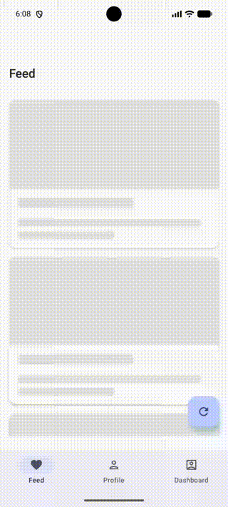
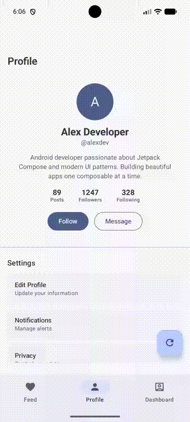
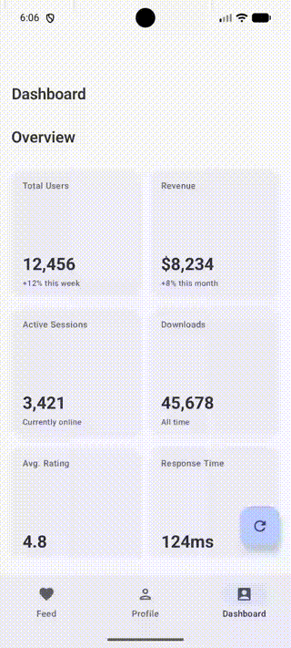

# 💀 Compose Skeleton Pack

> A lightweight, Compose-first Skeleton & Shimmer library for modern Android apps.

[](https://android-arsenal.com/api?level=24)
[](https://opensource.org/licenses/Apache-2.0)
[](https://developer.android.com/jetpack/compose)
[](https://m3.material.io/)

---

## ✨ Features

- **🎯 Compose-First** - Built entirely with Jetpack Compose, no legacy View dependencies
- **⚡ High Performance** - GPU-friendly shimmer animations, 60fps scrolling
- **🎨 Material 3 Ready** - Supports Material You dynamic colors and theming
- **🌙 Dark Mode** - Automatic light/dark theme adaptation
- **📦 Lightweight** - Minimal dependencies, small library size
- **🔧 Highly Customizable** - Flexible API for all skeleton needs
- **♿ Accessibility** - Proper semantics for screen readers

---

## 📸 Screenshots

| Feed Screen | Profile Screen | Dashboard Screen |
|:-----------:|:--------------:|:----------------:|
|  |  |  |

---

## 🚀 Installation

Add the dependency to your module's `build.gradle.kts`:

```kotlin
dependencies {
    implementation("com.ebin.skeleton:skeleton-core:1.0.0")
}
```

Or using version catalog (`libs.versions.toml`):

```toml
[versions]
skeleton = "1.0.0"

[libraries]
skeleton-core = { group = "com.ebin.skeleton", name = "skeleton-core", version.ref = "skeleton" }
```

---

## 📖 Quick Start

### Basic Skeleton Components

```kotlin
// Rectangular skeleton with rounded corners
SkeletonBox(
    modifier = Modifier
        .fillMaxWidth()
        .height(100.dp),
    shape = RoundedCornerShape(12.dp)
)

// Circular skeleton for avatars
SkeletonCircle(size = 64.dp)

// Text line skeleton
SkeletonLine(
    modifier = Modifier.fillMaxWidth(0.7f),
    height = 16.dp
)
```

### Pre-built Components

```kotlin
// Card skeleton with image, title, and description
SkeletonCard(
    imageHeight = 180.dp,
    titleLines = 1,
    showDescription = true,
    descriptionLines = 2
)

// List item skeleton with avatar and text
SkeletonListItem(
    leadingSize = 48.dp,
    isLeadingCircle = true,
    showSubtitle = true
)

// Profile skeleton with avatar, name, bio, and buttons
SkeletonProfile(
    avatarSize = 80.dp,
    showBio = true,
    actionButtonCount = 2
)

// Grid tile skeleton
SkeletonTile(
    modifier = Modifier.aspectRatio(1f),
    showLabel = true
)
```

### Skeleton Visibility Controller

```kotlin
Skeleton(
    isLoading = viewModel.isLoading,
    skeleton = { SkeletonCard() }
) {
    ActualCard(data = viewModel.data)
}

// With crossfade transition
Skeleton(
    isLoading = isLoading,
    transition = SkeletonTransition.Crossfade,
    transitionDurationMs = 400,
    skeleton = { SkeletonProfile() }
) {
    UserProfile(user = user)
}
```

### Nullable Data Helper

```kotlin
SkeletonIfNull(
    data = user,
    skeleton = { SkeletonProfile() }
) { user ->
    UserProfile(user = user)
}
```

### List Skeleton Support

```kotlin
LazyColumn {
    skeletonItems(
        isLoading = isLoading,
        count = 5
    ) {
        SkeletonListItem()
    }
    
    // Real items
    items(actualItems) { item ->
        ListItem(item)
    }
}
```

### Grid Skeleton Support

```kotlin
LazyVerticalGrid(columns = GridCells.Fixed(2)) {
    skeletonGridItems(
        isLoading = isLoading,
        count = 6
    ) {
        SkeletonTile(
            modifier = Modifier.aspectRatio(1f)
        )
    }
}
```

---

## 🎨 Shimmer Customization

### Basic Shimmer Modifier

```kotlin
Box(
    modifier = Modifier
        .size(100.dp)
        .background(Color.LightGray)
        .shimmer()
)
```

### Custom Shimmer State

```kotlin
val shimmerState = rememberShimmerState(
    durationMillis = 1200,
    direction = ShimmerDirection.LeftToRight
)

SkeletonCard(shimmerState = shimmerState)
SkeletonListItem(shimmerState = shimmerState)
```

### Shimmer Directions

```kotlin
// Horizontal shimmer
rememberShimmerState(direction = ShimmerDirection.LeftToRight)
rememberShimmerState(direction = ShimmerDirection.RightToLeft)

// Vertical shimmer
rememberShimmerState(direction = ShimmerDirection.TopToBottom)
rememberShimmerState(direction = ShimmerDirection.BottomToTop)
```

### Custom Colors

```kotlin
val shimmerState = rememberShimmerState(
    baseColor = Color(0xFFE0E0E0),
    highlightColor = Color(0xFFF5F5F5)
)
```

### Custom Shimmer Brush

```kotlin
Box(
    modifier = Modifier
        .size(100.dp)
        .shimmerWithBrush { progress, size ->
            Brush.linearGradient(
                colors = listOf(Color.Red, Color.Blue, Color.Red),
                start = Offset(-size.width + size.width * 2 * progress, 0f),
                end = Offset(size.width * 2 * progress, size.height)
            )
        }
)
```

---

## 🎨 Theming

### Default Theme Colors

The library automatically adapts to light/dark mode:

```kotlin
// Light mode defaults
baseColor = Color(0xFFE0E0E0)
highlightColor = Color(0xFFF5F5F5)

// Dark mode defaults
baseColor = Color(0xFF3A3A3A)
highlightColor = Color(0xFF4A4A4A)
```

### Material 3 Integration

```kotlin
// Use Material 3 surface colors
val colors = materialSkeletonColors()

SkeletonTheme(colors = colors) {
    SkeletonCard()
}
```

### Custom Theme

```kotlin
val customColors = customSkeletonColors(
    baseColor = MaterialTheme.colorScheme.surfaceVariant,
    highlightColor = MaterialTheme.colorScheme.surface
)

SkeletonTheme(colors = customColors) {
    // All skeleton components will use these colors
    SkeletonCard()
    SkeletonListItem()
}
```

---

## 📁 Project Structure

```
compose-skeleton/
├── skeleton-core/                    # Library module
│   └── src/main/java/com/ebin/skeleton/
│       ├── shimmer/
│       │   ├── ShimmerDirection.kt   # Animation directions
│       │   └── ShimmerState.kt       # Shimmer state management
│       ├── skeleton/
│       │   ├── SkeletonPrimitives.kt # Basic shapes
│       │   ├── SkeletonComponents.kt # Pre-built components
│       │   ├── SkeletonController.kt # Visibility controllers
│       │   └── LazySkeletonItems.kt  # List/Grid extensions
│       ├── modifier/
│       │   └── ShimmerModifier.kt    # Modifier extensions
│       └── theme/
│           ├── SkeletonColors.kt     # Color definitions
│           └── SkeletonTheme.kt      # Theme provider
├── sample-app/                       # Demo application
│   └── src/main/java/com/ebin/skeleton/sample/
│       ├── screens/
│       │   ├── FeedScreen.kt         # Feed demo
│       │   ├── ProfileScreen.kt      # Profile demo
│       │   └── DashboardScreen.kt    # Dashboard demo
│       ├── components/
│       │   └── RealComponents.kt     # Actual content
│       └── MainActivity.kt           # Entry point
└── README.md
```

---

## ⚡ Performance Notes

### Best Practices

1. **Shared Shimmer State** - Use a single `ShimmerState` for multiple skeletons to synchronize animations and reduce computation:
   
   ```kotlin
   val shimmerState = rememberShimmerState()
   
   repeat(5) {
       SkeletonListItem(shimmerState = shimmerState)
   }
   ```

2. **Avoid Unnecessary Recompositions** - The library is designed to minimize recompositions. Skeleton components only recompose when their parameters change.

3. **GPU-Friendly Animations** - Shimmer uses `Brush.linearGradient` which is hardware-accelerated and doesn't create bitmaps.

4. **Efficient List Rendering** - Use `skeletonItems` with proper keys for optimal RecyclerView-style performance:
   
   ```kotlin
   skeletonItems(
       isLoading = isLoading,
       count = 10,
       key = { "skeleton_$it" }  // Stable keys
   ) {
       SkeletonListItem()
   }
   ```

### What We Avoid

- ❌ No bitmap usage
- ❌ No reflection
- ❌ No unnecessary allocations during animation
- ❌ No blocking operations

---

## 🤔 Why Skeleton Loading?

Skeleton screens (also known as "content placeholders") improve perceived performance and user experience:

| Metric | Spinner | Skeleton |
|--------|---------|----------|
| Perceived Load Time | Feels longer | Feels shorter |
| User Anxiety | Higher | Lower |
| Content Preview | None | Layout hint |
| Professional Feel | Generic | Polished |

Research shows that skeleton screens can reduce perceived wait time by up to **30%** compared to traditional spinners.

---

## 📋 API Reference

### Skeleton Components

| Component | Description |
|-----------|-------------|
| `SkeletonBox` | Rectangular placeholder |
| `SkeletonCircle` | Circular placeholder |
| `SkeletonLine` | Text line placeholder |
| `SkeletonCard` | Card with image & text |
| `SkeletonListItem` | List item with avatar |
| `SkeletonProfile` | Profile header |
| `SkeletonTile` | Grid tile |

### Controllers

| Component | Description |
|-----------|-------------|
| `Skeleton` | Show skeleton or content |
| `SkeletonIfNull` | Skeleton until data loads |
| `SkeletonIfEmpty` | Skeleton until list has items |

### Modifiers

| Modifier | Description |
|----------|-------------|
| `Modifier.shimmer()` | Basic shimmer effect |
| `Modifier.shimmer(state)` | Shimmer with custom state |
| `Modifier.shimmerWithBrush()` | Custom shimmer brush |

---

## 🤝 Contributing

Contributions are welcome! Please feel free to submit a Pull Request.

1. Fork the repository
2. Create your feature branch (`git checkout -b feature/amazing-feature`)
3. Commit your changes (`git commit -m 'Add amazing feature'`)
4. Push to the branch (`git push origin feature/amazing-feature`)
5. Open a Pull Request

---

## 📄 License

```
Copyright 2026 Ebin

Licensed under the Apache License, Version 2.0 (the "License");
you may not use this file except in compliance with the License.
You may obtain a copy of the License at

    http://www.apache.org/licenses/LICENSE-2.0

Unless required by applicable law or agreed to in writing, software
distributed under the License is distributed on an "AS IS" BASIS,
WITHOUT WARRANTIES OR CONDITIONS OF ANY KIND, either express or implied.
See the License for the specific language governing permissions and
limitations under the License.
```

---

## 🙏 Acknowledgments

- [Jetpack Compose](https://developer.android.com/jetpack/compose) - Modern Android UI toolkit
- [Material 3](https://m3.material.io/) - Design system
- [Facebook Shimmer](https://facebook.github.io/shimmer-android/) - Inspiration for shimmer effect

---

<p align="center">
  Made with ❤️ for the Android community
</p>
